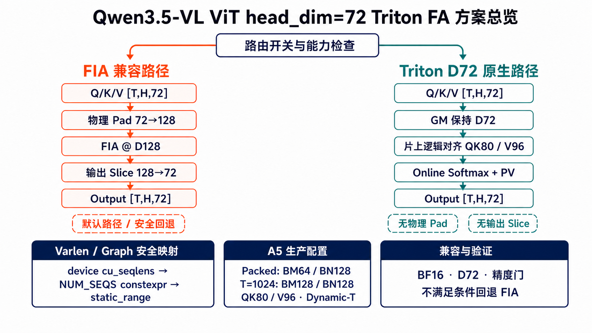
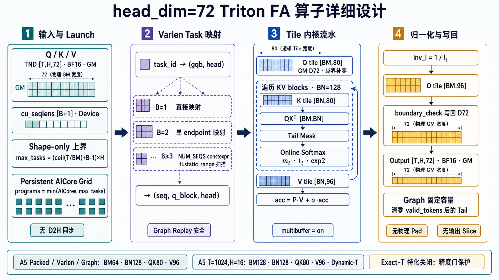

# Qwen3.5-VL ViT `head_dim=72` Triton FA 交接说明

更新日期：2026-07-21

## 当前结论

这项工作已经完成核心代码接入，但尚不能宣称“稳定 1.2x 已验收闭环”。

- Qwen3.5-VL 视觉 attention 的 Q/K/V 为 `[T,H,72]`。旧 FIA 路径会把 Q/K/V
  物理 pad 到 128，执行 FIA，再把输出切回 72。
- 新路径由 `VLLM_ASCEND_ENABLE_VIT_TRITON_FA=1` 开启，满足能力条件时直接读取
  `[T,H,72]`，不创建 `[T,H,128]` 的中间输入，也不执行输出切片。
- A5 packed/varlen 和 ACL Graph 使用实测更优的 `BM64/BN128/QK80/V88`；
  eager单序列`T=1024,H=16`保留`BM128/BN128/QK80/V96` dynamic-T路径。
  A2/A3 等其他 SoC 使用保守的 `BM64/BN64/QK80/V80`。三序列及以上的
  q-block 映射把固定 endpoint 槽数作为编译期参数静态展开，避免
  Triton-Ascend 3.2.1 的动态 Python range 触发 AICore timeout `507014`。
- A5 eager `T=1024,H=16,B=1` 的 compile-time `T=1024` 特化是当前唯一精度
  失败项，已由精度门关闭。该shape继续使用相同的`BM128/BN128/QK80/V96`，但走
  已通过的dynamic-T数值路径；后续只有完整精度套件通过后才能重新开启exact-T。
- eager输出没有固定容量尾部，因此kernel launch会编译掉tail-clear；`num_seqs==2`
  使用两个endpoint直接映射q-block，不再扫描metadata或执行保守的空task。
- eager、packed/tail、`int64 cu_seqlens` 和 encoder ACL Graph replay 均已有测试
  覆盖；当前开发机没有 NPU，无法复现真机测试。
- first-block online-softmax候选虽通过专项精度但性能明显回退，已完整删除。benchmark
  新增`--profile`，可一条命令分开采集FIA和Triton的PipeUtilization证据，避免继续盲调。
- 最新A5 packed采集显示Triton的`Vector=93.0%`、`Cube MAC=16.1%`；据此尝试的
  `enable_hivm_auto_cv_balance`候选在A5真机性能劣化，已完整撤回。
- 仓库记录过约 `1.20x` 的 microbenchmark 和 `1.207x` 的服务 TTFT 结果，但没有随
  提交保存原始日志、Profiler trace 或服务命令，因此这些属于历史实机报告，必须在
  当前提交上重新采样后才能作为验收证据。

本轮已经把生产配置、测试断言、运行日志和 benchmark 对齐；CPU pytest 仍需在项目
依赖匹配的环境中运行，A5 精度和性能必须在服务器上复验。

## 需求背景

Qwen3.5-VL 的 ViT attention 配置为 `hidden_size=1152`、`num_heads=16`，因此
`head_dim=72`。当前 FIA 调用链不能直接消费这个宽度，原实现必须：

1. 分别把 Q/K/V 从 `[T,H,72]` 物理补零到 `[T,H,128]`；
2. 在 128 宽上执行 FIA；
3. 将输出从 128 切回 72，并在需要时重新 contiguous。

这条路径不仅多出三个pad和一个slice，还让attention主体计算、GM读写和中间张量都
按128宽执行；相对真实72宽，多处理约`128/72=1.78x`的数据。需求目标是在不改变模型
接口和数值语义的前提下原生处理D72，同时满足：

- BF16、前向、非因果ViT attention；
- eager、packed varlen和encoder ACL Graph capture/replay；
- 开关默认关闭，任何不支持的输入安全回退FIA；
- 全量精度、tail clear、`int64 cu_seqlens`和graph replay测试通过；
- A5典型shape相对“FIA pad-to-128 + slice”争取稳定`1.2x～1.3x`，未达到时如实记录。

## 方案设计

整体方案先在路由层区分FIA兼容路径与Triton D72原生路径，并把Varlen/Graph映射、
A5生产配置和安全回退作为共同的支撑层：



*图1：方案总览。GM中的Q/K/V和输出保持真实D72；只有命中条件的请求进入Triton，
其余请求继续使用FIA兼容路径。*

Triton算子内部从device `cu_seqlens`完成task映射，以persistent AICore grid执行
QK、online softmax和PV流水，并通过block pointer边界检查实现片上逻辑对齐：



*图2：算子详细设计。Q/K逻辑宽度为80；图中的V96对应BM128单序列，BM64动态路径
使用V88；物理GM宽度始终为72。*

### 1. 路由与兼容边界

在`AscendMMEncoderAttention`中增加可选Triton分支，仅当开关开启且输入满足
`head_dim=72`、NPU BF16、三维同shape Q/K/V、合法device `cu_seqlens`时命中。
其余输入保持原FIA逻辑，因而关闭开关时等价于没有本特性。

### 2. D72原生存储、片上逻辑对齐

Q/K/V和输出在GM中始终保持`[T,H,72]`，不创建128宽中间张量。Triton block
pointer的parent shape仍是D72，只在片上为Cube计算使用逻辑宽度：Q/K为QK80，
V/output在A5 BM64 varlen/graph为V88、A5 BM128单序列为V96，其他SoC为V80。
`boundary_check`为逻辑尾列补零，并丢弃输出的越界列，因此没有物理pad和输出slice。

### 3. Attention内核

内核采用分块QK、online softmax和PV累加。每个task计算一个`(q-block, head)`；
persistent-core grid让每个AICore按步长处理多个task，并保持`multibuffer=True`。
生产代码不采用实测波动较大的per-task grid。dynamic-T路径的Q/K/V/O load/store始终
保留token和D两个维度的boundary check；Triton-Ascend 3.2.1不能安全地在运行时分支中
切换不同的block-pointer boundary模式。

### 4. Varlen与Graph安全映射

内核直接读取device `cu_seqlens`，不调用会触发D2H同步的`.tolist()`或
`prepare_chunk_indices`。单序列和双序列分别使用专用映射；三序列及以上把固定的
endpoint槽数作为`NUM_SEQS: tl.constexpr`，通过`tl.static_range`展开扫描，避免
Triton-Ascend 3.2.1动态Python range造成AICore timeout `507014`。

Graph capture使用固定容量输出和固定地址的`cu_seqlens` buffer，replay前只刷新buffer
内容。kernel在需要时清零有效token后的capacity tail；eager没有容量尾部，编译时移除
tail-clear循环。

### 5. A5分场景配置

- packed/varlen/ACL Graph：`BM64/BN128/QK80/V88`；
- 单序列`T=1024,H=16`：`BM128/BN128/QK80/V96` dynamic-T；
- A2/A3等其他SoC：`BM64/BN64/QK80/V80`。

A5 compile-time `T=1024` lowering曾是唯一剩余精度失败，因此由
`A5_EXACT_T_SPECIALIZATION_ENABLED=False`关闭。实现仍保留用于后续编译器验证，但
生产和benchmark默认都不得选择。V80、BN64和per-task grid也因实测回退或波动未落地。

### 6. 验证与性能口径

精度基线为CPU FP32 reference和FIA生产路径，容差为`atol=3e-2, rtol=3e-2`。
性能基线必须包含Q/K/V pad、FIA及输出slice；单次结果只作观察，最终使用独立进程、
持续warmup和epoch分位数验收。当前V88候选取得`1.2018x` epoch median和
`1.1974x` absolute-p50 median，但worst p10为`0.9996x`，因此文档不宣称稳定1.2x闭环。

## 开关和实际路由

唯一开关：

```bash
VLLM_ASCEND_ENABLE_VIT_TRITON_FA
```

- 未设置或设为 `0`：走 FIA，执行 `72 -> 128` pad、FIA、输出切片。
- 设为 `1`：满足下列条件时走 Triton，否则记录一次 fallback warning 并走 FIA。

Triton 路由条件：

- `head_dim == 72`
- Q/K/V 均为 NPU BF16 三维张量
- Q/K/V shape 相同且为 `[T,H,72]`
- `cu_seqlens` 是一维 NPU `int32` 或 `int64` 张量
- 当前环境可用 Triton

A5 路径：

| 场景 | 配置 | 路径标签 |
| --- | --- | --- |
| eager，`T=1024,H=16,B=1` 且只有两个 endpoints | `BM128/BN128/QK80/V96` + dynamic T（exact-T精度门关闭） | `varlen-BM128-BN128-QK80-V96` |
| A5 eager `num_seqs==2` | `BM64/BN128/QK80/V88` + direct two-sequence mapping | `varlen-BM64-BN128-QK80-V88` |
| A5 其他 eager、packed、video、tail | `BM64/BN128/QK80/V88` | `varlen-BM64-BN128-QK80-V88` |
| A5 ACL Graph capture/replay | `BM64/BN128/QK80/V88` | `varlen-BM64-BN128-QK80-V88` |
| A2/A3 等其他 SoC | `BM64/BN64/QK80/V80` | `varlen-BM64-BN64-QK80-V80` |

`QK80`、`V80`、`V88`和`V96`都是片上逻辑宽度，不是物理pad。block pointer的
parent shape仍为真实D=72，越界输入由boundary check补零，越界输出列被丢弃。

服务启动示例：

```bash
cd /path/to/vllm-ascend
export PYTHONPATH="$(pwd)${PYTHONPATH:+:$PYTHONPATH}"
export VLLM_ASCEND_ENABLE_VIT_TRITON_FA=1
# 后接原来的 vllm serve 命令和参数
```

关闭时必须用新进程重新拉起服务：

```bash
export VLLM_ASCEND_ENABLE_VIT_TRITON_FA=0
# 使用完全相同的 serve 参数
```

确认导入当前源码：

```bash
PYTHONPATH="$(pwd)${PYTHONPATH:+:$PYTHONPATH}" python3 -c \
  'import vllm_ascend.ops.triton.vit_flash_attention as m; print(m.__file__)'
```

命中 Triton 后会看到类似日志：

```text
[ViT Triton FA] ACTIVE: path=varlen-BM64-BN128-QK80-V88 ...
FIA pad-to-128 and output slicing are bypassed.
```

这是 Python 和 Triton JIT 代码，不需要重新编译 vLLM Ascend 的 C++ 扩展。首次命中
新 specialization 会发生 Triton JIT，首次编译耗时不能计入稳态性能。

## 代码分布

| 文件 | 作用 |
| --- | --- |
| `vllm_ascend/envs.py` | 定义默认关闭的环境变量 |
| `vllm_ascend/ops/triton/vit_flash_attention.py` | Triton kernel、SoC 配置、wrapper 和运行日志 |
| `vllm_ascend/ops/mm_encoder_attention.py` | eager/ACL Graph 路由、FIA fallback、layout 恢复 |
| `vllm_ascend/worker/encoder_acl_graph.py` | graph replay metadata 刷新及 Triton-only D2H 绕过 |
| `tests/ut/ops/test_vit_flash_attention.py` | CPU mock 的配置、launch、路由和统计测试 |
| `tests/ut/ops/a2/test_vit_flash_attention.py` | 真 NPU 精度、tail、exact 和 graph replay 测试 |
| `tests/ut/worker/test_encoder_acl_graph.py` | encoder graph replay 单元测试 |
| `benchmarks/ops/benchmark_vit_flash_attention.py` | FIA/Triton microbenchmark 与独立Profiler采集 |
| `benchmarks/ops/bench_repeat_vit_fa.sh` | 5 个以上独立进程的性能汇总 |

## 已有证据与证据缺口

以下是前序开发者写入仓库的实机报告，不是当前开发机复现结果：

| 项目 | 历史报告 | 当前判断 |
| --- | --- | --- |
| A5 NPU 测试 | `24 passed / 0 failed / 0 skipped` | 没有原始 pytest 输出，当前提交需重跑 |
| exact `T=1024,H=16` | 绝对 p50 比约 `1.204x` | 单次聚合结果，不足以证明 5/5 稳定达标 |
| packed `[512,512]` V88 | epoch median `1.2018x`，absolute p50 median `1.1974x` | benchmark correctness通过；完整精度和graph replay待复验 |
| 服务 A/B | TTFT `1436ms -> 1190ms`，约 `1.207x` | 没有服务命令、请求集和原始数据 |
| 单层 ViT profile | FIA 路径约 `15.746ms`，Triton约 `6.2ms` | 没有 trace/CSV/DB，需重新采集 |

历史 profile 的 FIA 拆分为：FIA 本体 `15.484ms`、三个 pad 合计 `0.205ms`、slice
`0.057ms`，总和为 `15.746ms`。它提示主要收益可能来自避免在128宽上执行主计算，
而不只是删除pad/slice，但没有硬件计数器和trace，不能把这个解释视为已经证明。

另外，`FULL_DECODE_ONLY` 日志本身不能证明 encoder attention 已被 ACL Graph 捕获。
若要声称 graph 路径通过，必须保留 `_forward_capture_fia` capture/replay 的直接证据或
对应测试输出。

## 理论分析

FIA pad路径的主矩阵逻辑宽度近似为：

```text
QK 128 + PV 128 = 256
```

当前A5 Triton逻辑宽度为：

```text
QK 80 + PV 96 = 176
```

只按主矩阵元素量计算，理想比值为：

```text
256 / 176 = 1.4545x
```

这不是算子性能保证，也不是可以与GM宽度比继续相乘的结论。softmax、任务枚举、
boundary check、类型转换、流水、UB/L1占用、Cube利用率和FIA厂商实现效率都会改变
实际结果。是否真的按80/96执行，必须查看编译IR、资源报告和Profiler计数器。

若历史服务数据中的非ViT固定部分约为 `1011ms`，则只优化ViT时TTFT理论极限为
`1436/1011 = 1.42x`。因此`1.20x`是当前观测，不是严格上限。要达到TTFT `1.30x`，
总耗时需降至约 `1104.6ms`，留给ViT的预算约 `93.6ms`；相对历史Triton ViT约
`167ms`仍需约 `1.79x` 的进一步加速，难度很高但不能仅凭Amdahl分析判为不可能。

## 测试方法

以下步骤可以直接交给服务器同学执行。算子精度和性能测试不需要拉起vLLM服务，也不需要
设置 `VLLM_ASCEND_ENABLE_VIT_TRITON_FA`；benchmark会直接调用FIA基线和Triton候选。
只有最后的真实模型A/B才需要分别用开关0和1重启服务。

### 1. 测试前准备

进入服务器上的仓库，确保实际导入的是当前源码，并记录版本：

```bash
cd /path/to/vllm-ascend
export PYTHONPATH="$(pwd)${PYTHONPATH:+:$PYTHONPATH}"

git status --short --branch
git rev-parse HEAD
python3 -c \
  'import vllm_ascend.ops.triton.vit_flash_attention as m; print(m.__file__)'
python3 -c \
  'import torch, torch_npu; print("torch", torch.__version__); print("soc", torch_npu.npu.get_soc_version())'
python3 -m pip show torch-npu triton-ascend | grep -E '^(Name|Version):'
```

`m.__file__`必须指向当前仓库，不应指向其他环境的 `site-packages`。项目验收基于
`triton-ascend==3.2.1`；其他版本的数据必须单独注明，不能与当前结果直接合并。

脚本会按运行时SoC自动选生产配置：

| 服务器 | benchmark实际使用的Triton配置 | 结果适用范围 |
| --- | --- | --- |
| A5 exact shape `T=1024,H=16,B=1` | `BM128/BN128/QK80/V96` dynamic T | 只代表A5单序列shape |
| A5 packed/varlen/graph | `BM64/BN128/QK80/V88` | 只代表A5动态路径 |
| A2/A3 | `BM64/BN64/QK80/V80` | 只代表对应SoC |

A2和A5运行的是同一个算法，但tile配置不同，因此A2可以验证功能并测A2收益，不能用
A2结果替代A5验收，也不能把A5的1.2x结果直接套到A2。

### 2. CPU配置、路由和graph管理测试

```bash
PYTHONPATH="$(pwd)${PYTHONPATH:+:$PYTHONPATH}" python3 -m pytest -q \
  tests/ut/ops/test_vit_flash_attention.py \
  tests/ut/worker/test_encoder_acl_graph.py \
  tests/ut/test_envs.py
```

当前开发机曾在collection阶段因本地vLLM版本不匹配失败：

```text
ImportError: cannot import name 'ColoredFormatter' from vllm.logging_utils
```

这既不代表测试通过，也不是算子精度失败。必须在项目依赖匹配的环境重跑。

### 3. 真机精度和graph replay（性能测试前必须通过）

整份测试在A2和A5都能执行。文件位于 `tests/ut/ops/a2/` 是CI目录划分，不表示只能
在A2运行；它会读取运行时SoC。A5 exact专项case在A2上会显示skip，这是预期行为。

A5先单独跑exact编译和精度门：

```bash
PYTHONPATH="$(pwd)${PYTHONPATH:+:$PYTHONPATH}" python3 -m pytest -sv \
  tests/ut/ops/a2/test_vit_flash_attention.py::test_a5_full_aligned_bm128_precision
```

然后A2或A5都运行整份测试：

```bash
PYTHONPATH="$(pwd)${PYTHONPATH:+:$PYTHONPATH}" python3 -m pytest -sv \
  tests/ut/ops/a2/test_vit_flash_attention.py
```

重点单独复查graph replay：

```bash
python3 -m pytest -sv \
  tests/ut/ops/a2/test_vit_flash_attention.py::test_npu_graph_replay_reads_current_cu_seqlens
```

要求当前SoC适用的case全部通过，且没有MLIR编译错误、NaN、未写输出或
`tensor-likes are not close`。A2上的A5专项skip不算失败。任何适用case失败时停止性能
测试，先保存完整编译和pytest输出。

### 4. 单次算子性能测试

```bash
PYTHONPATH="$(pwd)${PYTHONPATH:+:$PYTHONPATH}" \
  python3 benchmarks/ops/benchmark_vit_flash_attention.py
```

默认shape固定为packed `[512,512]`、`T=1024,H=16,D=72`，默认使用isolated burst，
并逐epoch交替先测FIA还是Triton。输出只显示在屏幕，不生成JSON或日志文件。脚本会：

1. 通过SoC选择器取得真实生产tile，而不是硬编码A5配置；
2. 先做 `torch.testing.assert_close(atol=3e-2, rtol=3e-2)`；
3. FIA侧计入Q/K/V pad、FIA和输出slice/contiguous；
4. 输出git SHA、SoC、依赖版本、timing mode、FIA/Triton p50/p90/MAD和epoch区间。

再测单序列 `[1024]`：

```bash
PYTHONPATH="$(pwd)${PYTHONPATH:+:$PYTHONPATH}" \
  python3 benchmarks/ops/benchmark_vit_flash_attention.py --seq-lens 1024
```

生产配置复验后，可以一次只覆盖一个Triton候选；每次输出仍然只有FIA与该候选的
两路对比，不会混入新旧Triton结果。A5 exact优先测下面三组：

```bash
# 仅把V96缩到V80
python3 benchmarks/ops/benchmark_vit_flash_attention.py \
  --seq-lens 1024 --block-m 128 --block-n 128 --qk-pad 80 --v-pad 80

# V80配BN64
python3 benchmarks/ops/benchmark_vit_flash_attention.py \
  --seq-lens 1024 --block-m 128 --block-n 64 --qk-pad 80 --v-pad 80

# 更小的Q tile
python3 benchmarks/ops/benchmark_vit_flash_attention.py \
  --seq-lens 1024 --block-m 64 --block-n 128 --qk-pad 80 --v-pad 80

# 保持生产tile，只切换为每task一个program的实验调度
python3 benchmarks/ops/benchmark_vit_flash_attention.py \
  --seq-lens 1024 --per-task-grid
```

候选默认也使用通过精度门的dynamic-T路径；不得仅为了性能打开compile-time
`T=1024`。只有exact-T单独通过精度、全量精度与graph replay，并且至少5个独立进程
稳定优于当前生产配置，才能重新启用。

输出检查顺序：

1. `Correctness: PASS`：候选输出先与FIA生产基线比较；没有这行不能看性能。
2. `Triton production path=...`：A5 exact shape应显示BM128/BN128/QK80/V96；
   A5 packed/varlen应显示BM64/BN128/QK80/V88；A2/A3应显示BM64/BN64/QK80/V80。
   若不符，先检查SoC识别和导入路径。
3. `FIA (pad-to-128 + slice)`：基线计时包含三个pad、FIA和输出slice/contiguous。
4. `epoch speedup (FIA / Triton)`：大于1表示Triton更快，小于1表示Triton更慢。
5. `in-run stable/UNSTABLE`：仅表示单进程内部噪声，并以`noisy=0/1`汇总，不丢弃
   执行成功且可解析的run。
6. `epoch p10-p90`和MAD：用于解释尾部收益及波动，最终以五进程汇总为准。

建议同学回传两种shape的完整屏幕输出，不要只回传最后一个加速比。只有诊断交错cache
影响时才使用 `--interleaved`；生产结论使用默认isolated结果。

### 5. 独立算子Profiler采集

性能结果达不到预期时，不再继续盲调tile。直接执行：

```bash
PYTHONPATH="$(pwd)${PYTHONPATH:+:$PYTHONPATH}" \
  python3 benchmarks/ops/benchmark_vit_flash_attention.py --profile
```

默认仍是生产packed `[512,512]` 和运行时SoC对应的生产配置。该模式先做FIA/Triton
精度比较，然后分别warmup、分别创建Profiler上下文，各采集5次，不运行耗时较长的
epoch benchmark。这样FIA的三个pad、FIA主体与slice不会和Triton kernel混在同一条
采集时间线里。

屏幕对每个shape只打印一条结果，例如：

```text
PROFILE_RESULT seq=512+512 cfg=BM64-BN128-QK80-V88 fia_us=120.000 tri_us=100.000 prof_ratio=1.200x mac=70.0% aic_mte2=20.1% vec=80.0% aiv_mte2=30.1% aiv_mte3=NA
```

其中只保留FIA/Triton的device kernels耗时/call和Triton耗时加权的Cube MAC、
Cube MTE2、Vector计算及Vector MTE2/MTE3占比；缺失的Profiler列显示为`NA`。
采集使用`ProfilerLevel.Level1 + AiCMetrics.PipeUtilization`；`prof_ratio`是插桩数据，
用于定位Cube/Vector/搬运瓶颈，不是正式加速比，也不包含L2命中率。正常性能结论仍以
第4节和第6节为准，同学只需回传这一条`PROFILE_RESULT`。

原始结果保存在当前执行目录下：

```text
vit_fa_profile/<timestamp>/case-01-T1024-B2/{fia,triton}/
```

Profiler过程日志保存在同一时间戳目录的`profile.log`，不再刷屏。如仓库位于网络盘，
可用`--profile-dir /local/path/vit_fa_profile`改到服务器本地盘；用`--profile-runs N`
改变每路采集次数。需要采集单序列时追加`--seq-lens 1024`。

### 6. 五进程算子性能门

默认packed：

```bash
bash benchmarks/ops/bench_repeat_vit_fa.sh
```

exact：

```bash
bash benchmarks/ops/bench_repeat_vit_fa.sh 5 --seq-lens 1024
```

脚本不写文件。默认只显示一次case/config、每个进程一行p50/epoch/p10和最终汇总；
需要排查子进程完整输出时，在进程数后增加`--verbose`。单进程内部的`UNSTABLE`
仅作为`noisy=1`提示，仍计入最终五进程统计；只有进程报错、精度失败或输出解析失败
才使脚本返回失败。当前A5观察目标为：

- 至少5个独立进程；
- 五进程epoch speedup中位数 `>=1.20x`；
- 五进程最差epoch p10 `>=1.15x`。

同时报告每进程配对的 `FIA p50 / Triton p50` 比值，不再用不同进程的两个中位数相除。

需要注意：这是当前A5观察目标，不是脚本成功条件。汇总行以`target=MET/MISS`展示
是否达到目标，但不因`MISS`返回失败。A2如果得到例如`1.05x`，仍是有效性能数据，
应报告为“A2有约1.05x收益、未达到A5目标”。只有进程报错、精度失败或解析失败才
代表测试过程无效。

同学回传内容至少包括：

- 测试机是A2还是A5；
- `git rev-parse HEAD`；
- CANN、torch、torch-npu、triton-ascend版本；
- exact精度、整份NPU精度和graph replay结果；
- packed与单序列各5轮的完整输出和最终 `RESULT` 行；
- 测试期间是否有其他任务共享NPU。

### 7. 服务A/B

用完全相同的模型、图片/视频集、请求顺序、并发、输出长度、graph模式和服务参数，
分别设置开关0和1后重启服务。至少保存：

- git SHA、SoC、CANN、PyTorch、torch-npu、Triton-Ascend版本；
- 完整启动命令和环境变量；
- 请求集、warmup规则和原始逐请求数据；
- TTFT/ITL/吞吐的p50、p90、置信区间；
- `ACTIVE`日志及必要的Profiler证据。

## 已知失败方向

- 三序列用例`[1,65,127]`曾因动态`range(num_seqs)`触发AICore timeout
  `507014`，并污染同进程后续用例；现将固定shape的`NUM_SEQS`作为constexpr，
  用`tl.static_range`展开endpoint扫描。若这里再次超时，优先检查生成IR中的循环。
- A5 compile-time `T=1024` 是修复动态循环后唯一剩余的精度失败；生产和benchmark
  已通过`A5_EXACT_T_SPECIALIZATION_ENABLED=False`关闭，T=1024继续走dynamic-T。
- A5 packed `[512,512]` 的compile-time fixed mapping未通过BM64精度用例，已完全删除。
- dynamic full-block boundary候选同样失败：在运行时根据
  `q_start/start_n + block <= T_seq`切换token boundary模式后，A5报告13个
  `AssertionError`、2个`tensor-likes are not close`，graph replay在endpoints
  `[0,37,165,294,384]`留下未写输出。该候选已删除，不能重新开启。
- A5 packed `[512,512]` 的BM64/BN128/QK80/V96五进程结果为epoch median
  `1.2040x`、absolute p50 median `1.2090x`，均优于BM128生产基线；最低单轮
  `1.1742x`仍未达到“每轮>=1.20x”的严格门，因此不能写成稳定1.2x已闭环。
- 在最新有效V96基线`1.0964x/1.1033x`上，V88候选五进程得到epoch median
  `1.2018x`、absolute p50 median `1.1974x`，范围分别为`1.0221-1.2080x`和
  `1.0128-1.2118x`。因此V88被选为A5 BM64生产候选，但仍须通过完整精度和graph replay。
- 独立全constexpr BM128 kernel曾出现 `tensor-likes are not close`，已删除。
- `multibuffer=False`曾造成大面积 `MLIRCompilationError`。
- `BM128/BN128/QK80/V128`会spill A5 UB并编译失败；不要回退到V128。
- pre-dot BF16 Q scale曾回退到约 `0.8896x`。
- packed双序列的同-head q-block调度候选通过了专项精度，但A5性能不如原
  q-block-major生产调度。其运行时task映射开销和调度变化没有被K/V缓存复用抵消，
  候选已删除。
- first-block online-softmax初始化候选通过了A5 packed专项精度，但实测性能明显差于
  通用循环。省掉首块一次alpha/rescale的Vector工作不足以抵消分裂循环后对统一流水和
  multibuffer lowering的影响；该候选及其kernel constexpr、benchmark参数和专项测试
  已全部删除。
- 基于`Vector=93.0%`尝试的Triton-Ascend 3.2.1
  `enable_hivm_auto_cv_balance`编译选项在A5 packed真机性能劣化，已从kernel、日志和
  测试中完整删除。自动CV平衡会改变当前multibuffer lowering，不能仅凭管线占用开启。
- A5 packed 将 `BN128` 扩大为 `BN256`，理论上把每个512-token序列的online-softmax
  merge次数从4次减到2次，但A5真机整体性能一般、没有优于BN128基线。更大的QK/P
  中间tile增加Vector和片上资源压力，抵消了循环次数收益，因此生产配置已恢复BN128。
- 不要把交错ABBA的FIA cache双峰直接解释为生产收益。
- 不要把Cube工作量比与GM宽度比机械相乘来证明2.5x。

每次只改变一个变量，先过exact、全量精度和graph replay，再测性能。

## 下一步

1. 在依赖匹配环境跑CPU测试，确认本轮测试断言和日志同步无误。
2. 在A5 + 项目锁定的 `triton-ascend==3.2.1` 上重跑完整NPU精度套件。
3. 用默认packed和exact各跑至少5个独立进程，保存完整屏幕输出。
4. 若未稳定达标，采集IR、资源报告和Profiler，确认80/96是否被后端重pad、是否spill、
   Cube/Vector利用率、流水stall、GM流量和K/V重复读取，再决定下一轮优化。
5. 最后做可复现服务A/B；microbenchmark达标不等于服务同幅提升。

## Git约束

维护者要求fork相对最新 `upstream/main` 始终只保留一个功能提交。未经明确要求不要
提交、rebase或推送。发布时先确认工作区和测试，再rebase最新上游、amend唯一提交并
使用 `git push --force-with-lease`。
